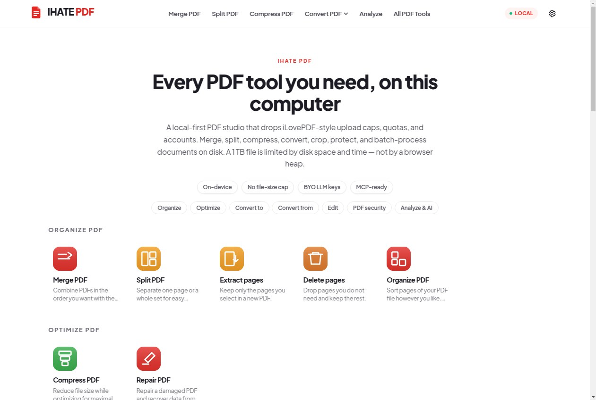
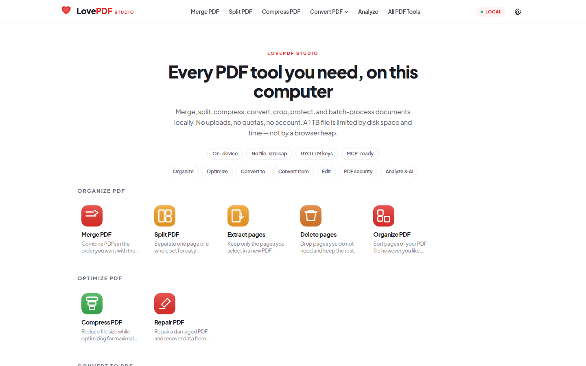
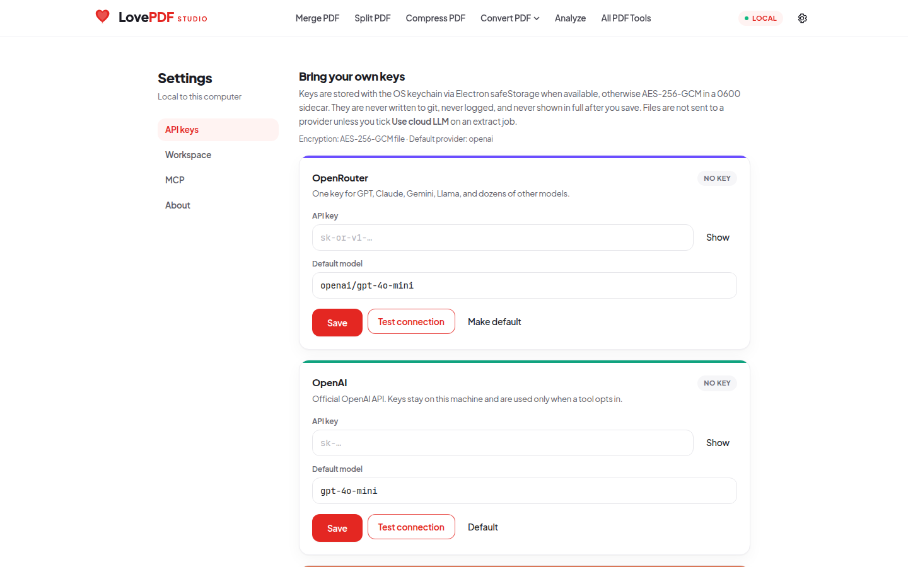
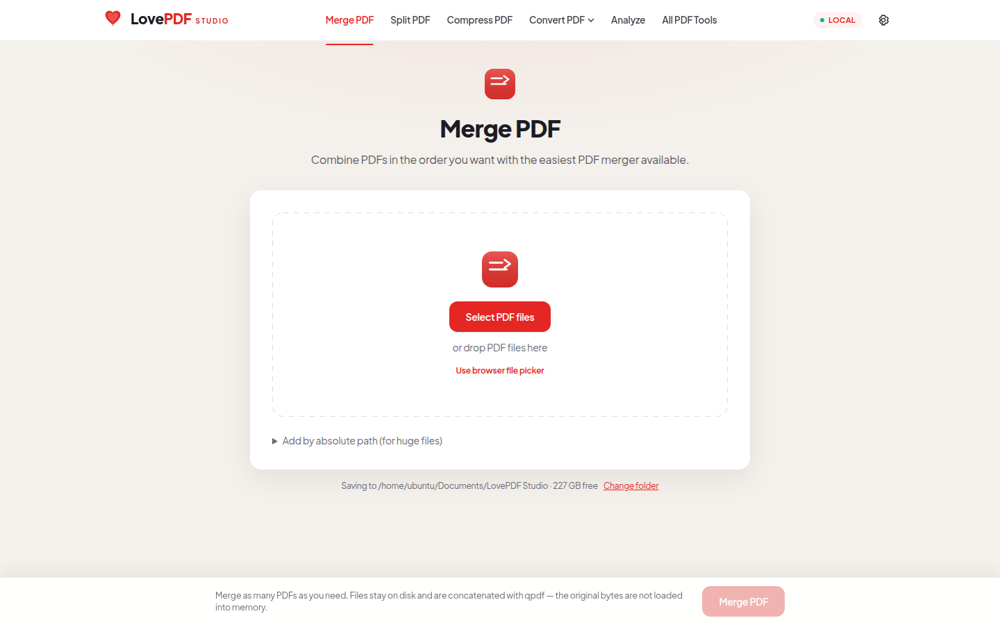
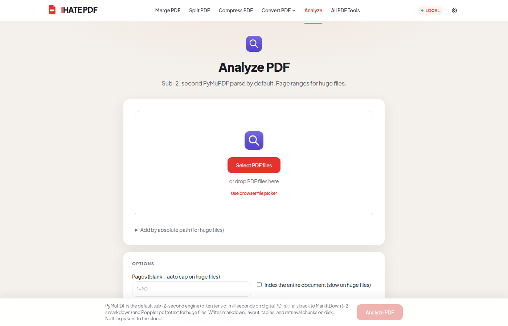
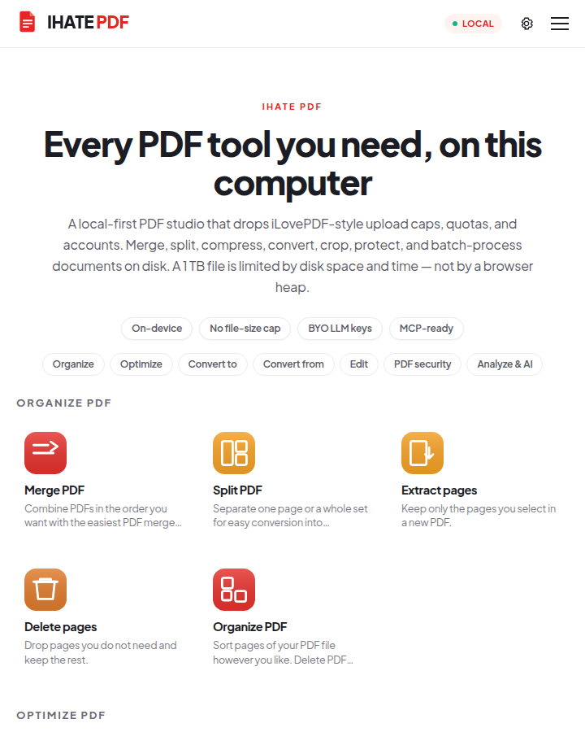
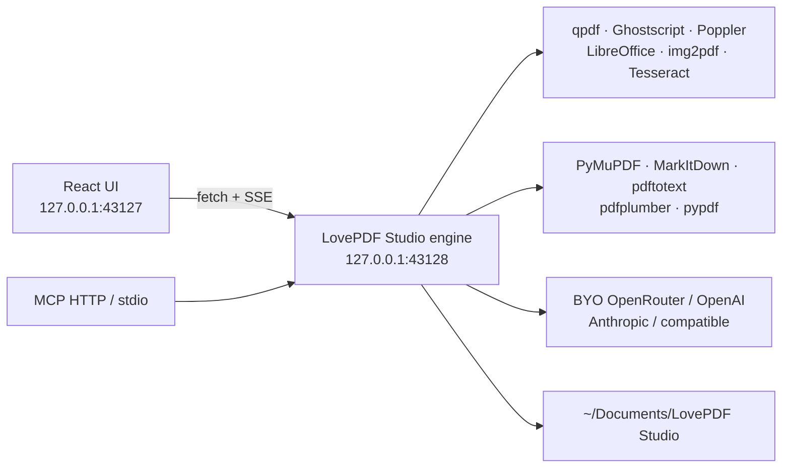

<p align="center">
  
</p>

<h1 align="center">LovePDF Studio</h1>

<p align="center">
  <strong>A local-first desktop PDF studio.</strong><br />
  Merge, split, compress, convert, crop, protect, analyze, and batch-extract — on this computer.
</p>

<p align="center">
  
  
  
  
  
  
</p>

LovePDF Studio is an independent, open-source Electron app. Nothing is uploaded unless you explicitly tick **Use cloud LLM** on an extract, summarize, ask, or translate job. There is no account, no quota, and no artificial file-size or file-count cap. A 1&nbsp;TB PDF is limited by **free disk and time**, not by a browser heap.

It is **not affiliated with iLovePDF**.

---

## Screenshots

| Home | Settings · BYO keys |
| --- | --- |
|  |  |

| Merge empty state | Analyze PDF |
| --- | --- |
|  |  |

<p align="center">
  
  <br /><em>The same chrome, tightened for a smaller desktop window.</em>
</p>

---

## Why a desktop studio

Browser PDF sites hit three walls: upload limits, storage quotas, and RAM. LovePDF Studio keeps every file on disk and shells out to streaming CLI tools (`qpdf`, Poppler, Ghostscript, LibreOffice, img2pdf, Tesseract). The renderer sends **paths**, not bytes.

| You get | How |
| --- | --- |
| Merge / split / organize / rotate | `qpdf` page tree — does not load the document into Node |
| Compress / PDF/A / repair | `qpdf` streams; Ghostscript only when you ask for a rewrite |
| Office ↔ PDF | Local LibreOffice |
| JPG / scans → PDF | `img2pdf` without decoding a giant bitmap |
| Analyze in well under 2 s | [PyMuPDF](https://github.com/pymupdf/PyMuPDF) by default (often tens of milliseconds); [MarkItDown](https://github.com/microsoft/markitdown) for markdown; Poppler for huge files |
| Bank, M-PESA, invoice extract | Line-by-line tables + regex; M-PESA auto-detect; optional LLM refine of **extracted text only** |
| Extract anything | Local entities + your JSON schema or plain-English request (Reducto Extract-style, on disk) |
| Ask / summarize / translate | On-disk chunks + your key, never the PDF bytes |
| Huge batches | A job queue with bounded concurrency |

---

## Bring your own LLM keys

Open **Settings → API keys** and connect any of:

- **OpenRouter** — one key for GPT, Claude, Gemini, Llama, …
- **OpenAI**
- **Anthropic**
- **OpenAI-compatible** — Ollama, vLLM, LM Studio, Together, Groq, Azure, or anything that speaks `/v1/chat/completions`

Keys are encrypted with Electron `safeStorage` (OS keychain) when available, otherwise AES-256-GCM in a `0600` sidecar under the app user-data folder. The UI never shows a raw key after save (only `••••last4`). **Test connection** sends `ping` / `pong` — no PDF.

Environment fallbacks (optional): `OPENROUTER_API_KEY`, `OPENAI_API_KEY`, `ANTHROPIC_API_KEY`, `OPENAI_COMPATIBLE_API_KEY`, `OPENAI_COMPATIBLE_BASE_URL`.

---

## MCP

The same engine is available to Cursor, Claude Desktop, and other MCP clients.

| Transport | How |
| --- | --- |
| HTTP JSON-RPC | Enable **Settings → MCP**, then `http://127.0.0.1:43128/mcp` |
| stdio | `node mcp/lovepdf-mcp.mjs` (example: [`mcp/cursor-mcp.example.json`](mcp/cursor-mcp.example.json)) |

Tools: `parse_pdf`, `extract_bank`, `extract_mpesa`, `extract_invoice`, `extract_anything`, `ask_pdf`. Paths stay on this machine. Optionally run Microsoft’s `markitdown-mcp` beside it for generic file → markdown.

---

## Architecture



Jobs are queued so a folder of hundreds of PDFs does not fork hundreds of processes.

---

## Tools

**Organize** — Merge, Split, Extract pages, Delete pages, Organize / reorder, Rotate  
**Optimize** — Compress, Repair, PDF/A  
**Convert to PDF** — JPG / scan, Word, Excel, PowerPoint, HTML  
**Convert from PDF** — JPG, Word, Excel, PowerPoint, Markdown, embedded images  
**Edit** — Watermark, page numbers, crop / margins, add text, OCR, PDF Forms  
**Security** — Protect, Unlock, Sign (image stamp), Redact, Compare  
**Analyze & AI** — Analyze PDF, Bank extract, M-PESA extract, Invoice extract, Extract anything, Ask PDF, Summarize, Translate

Missing binaries fail with an install hint instead of a silent stub.

---

## Huge files, honestly

- The renderer never reads file bytes into `Buffer` / `ArrayBuffer` for processing.
- Analyze writes `pages/` and `chunks/` on disk. Retrieval scores those files. Default index cap is 200 pages unless you pass a range or tick “entire document”.
- Intermediate work lives in the OS temp directory and is deleted when the job finishes.
- Outputs land in `~/Documents/LovePDF Studio` (changeable in Settings).
- Ghostscript (lossy compress, PDF/A) can use more RAM; files over ~2&nbsp;GB stay on the `qpdf` path when that is safer.
- Processing a 1&nbsp;TB file still needs roughly that much **free disk** for the output.

---

## Run it

System tools (once):

```bash
# Debian / Ubuntu
sudo apt install qpdf poppler-utils ghostscript python3-img2pdf imagemagick \
  libreoffice-nogui python3-reportlab python3-pikepdf zip tesseract-ocr

# Fast local parse + extract (PyMuPDF is the sub-2s engine)
pip install --user -r resources/requirements-extract.txt

# macOS
brew install qpdf poppler ghostscript img2pdf imagemagick
# LibreOffice: https://www.libreoffice.org/
```

Then:

```bash
npm install
npm run dev
```

That starts:

- Vite renderer at **http://127.0.0.1:43127**
- Engine API at **http://127.0.0.1:43128**
- an Electron window (`--no-sandbox` is already in the npm script)

```bash
npm run smoke          # qpdf merge/split path
npm run test:extract   # PyMuPDF speed + bank / M-PESA / invoice / extract-anything
npm run mcp            # stdio MCP bridge (engine must be running)
```

Renderer-only: `npm run dev:web` — the engine still has to be up for picking files and jobs.

---

## Parsers we researched (and how Studio uses them)

Open **Settings → Parsers** in the app for live install status. “Razer / Extract” is [Reducto Parse + Extract](https://reducto.ai/parse) (also sometimes Azure Document Intelligence or Ragie). Studio implements the same split locally: **Parse** (Analyze PDF) and **Extract** (Bank / M-PESA / Invoice / Extract anything).

| Library | Role in Studio | Speed class |
| --- | --- | --- |
| **[PyMuPDF](https://github.com/pymupdf/PyMuPDF)** | **Default.** Shipped when `pip install pymupdf` is present. | Sub-2 s (often 5–200 ms) |
| **[Microsoft MarkItDown](https://github.com/microsoft/markitdown)** | Optional markdown path | ~1–3 s |
| **[Poppler pdftotext](https://poppler.freedesktop.org/)** | Huge-file streaming fallback | Windowed, disk-safe |
| **[pdfplumber](https://github.com/jsvine/pdfplumber)** | Bank / M-PESA tables | Fast on digital ledgers |
| **[pypdf](https://github.com/py-pdf/pypdf)** | PDF Forms | Form fields only |
| **[Extractous](https://github.com/yobix-ai/extractous)** | Optional “Extract” library (Rust/Tika) | Fast Office/email |
| **[Reducto Parse + Extract](https://reducto.ai/parse)** | Cloud analogue of Analyze + Extract anything | Hosted VLM |
| **[Azure Document Intelligence](https://learn.microsoft.com/azure/ai-services/document-intelligence/)** | Cloud; another “Razer” mishear | Cloud |
| **[Marker 2](https://github.com/datalab-to/marker)** | Optional layout (not bundled) | Fast no-OCR CPU |
| **[IBM Docling](https://github.com/docling-project/docling)** | Optional layout | ~0.5–3 s/page |
| **[MinerU](https://github.com/opendatalab/MinerU)** | Optional formulas/CJK | GPU |
| **[LlamaParse](https://github.com/run-llama/llama_parse) / LlamaExtract** | Cloud RAG + schema extract | Cloud |
| **[Unstructured](https://github.com/Unstructured-IO/unstructured)** | Optional elements pipeline | Seconds/page |
| **[Camelot / Tabula](https://github.com/camelot-dev/camelot)** | Classic M-PESA `mpesa2csv` stack; Java not required here | Per-page tables |
| **[Tesseract](https://github.com/tesseract-ocr/tesseract) / OCRmyPDF** | Scans | Seconds/page |
| **Amazon Textract / Google Document AI** | Cloud forms | Cloud |
| **[Ragie](https://www.ragie.ai/)** | Hosted RAG | Cloud |
| **Apache Tika** | Prefer Extractous | JVM |
| **GROBID** | Academic PDFs | Optional |
| **PaddleOCR / EasyOCR / Surya** | Optional OCR upgrades | GPU-friendly |

Bank extract reads **every ledger line**. M-PESA extract keeps receipt, completion time, details, status, Paid In, Withdrawn, and Balance. Extract anything accepts a JSON schema or a sentence like “all till numbers and the closing balance”, and can refine with your LLM key without uploading the PDF.

---

## License

[MIT](LICENSE) © James Epale

LovePDF Studio is independent open-source software. Not affiliated with, endorsed by, or a substitute name for iLovePDF.
