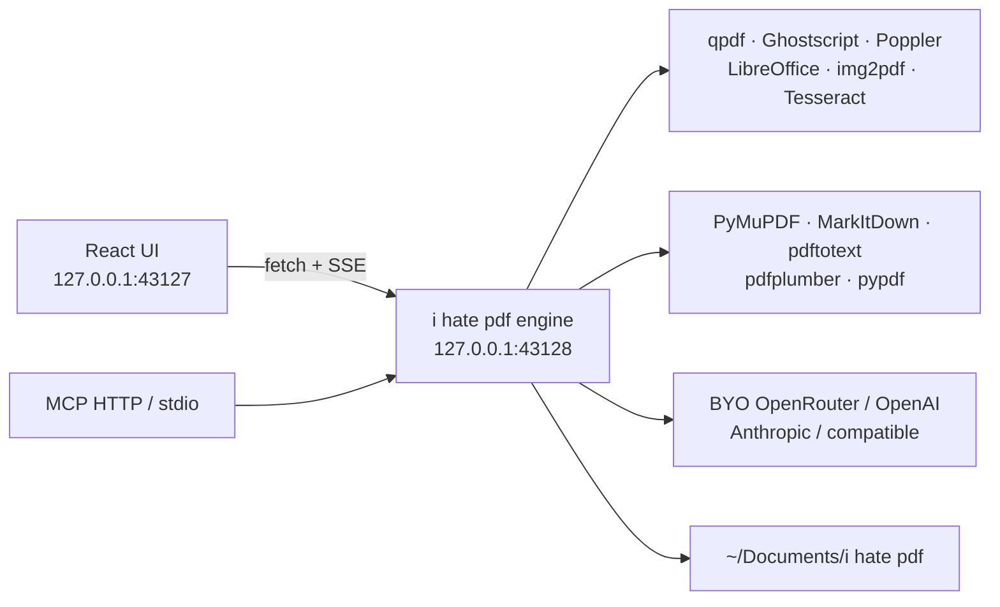

<h1 align="center">
  <picture>
    <source media="(prefers-color-scheme: dark)" srcset="docs/brand/wordmark-dark.svg" />
    
  </picture>
</h1>

<p align="center">
  <strong>i hate pdf</strong> — an independent, local-first desktop PDF studio.<br />
  Merge, split, compress, convert, crop, protect, analyze, and batch-extract on this computer.
</p>

<p align="center">
  <em>Last updated: 21 September 2026</em>
</p>

<p align="center">
  
  
  
  
  
  
  <a href="https://github.com/imodoiepale/ihate-pdf/releases"></a>
  <a href="https://github.com/imodoiepale/ihate-pdf/actions/workflows/release.yml"></a>
</p>

<p align="center">
  
</p>

**i hate pdf** is an independent, open-source desktop PDF studio (Electron and Tauri shells). Files stay on disk. Nothing is uploaded unless you explicitly tick **Use cloud LLM** on an extract, summarize, ask, or translate job. A large PDF is limited by **free disk and time**, not by a browser heap.

**i hate pdf** is not affiliated with, endorsed by, or part of iLovePDF or any other PDF company. Third-party names used in this project (including iLovePDF and other product names) belong to their owners.

The npm package slug is `ihate-pdf`. The name on screen is three lowercase words: a red **i**, then ` hate pdf`. App id: `com.ihatepdf.app`.

Our code is [MIT](LICENSE). Third-party tools and libraries are listed in [NOTICE.md](NOTICE.md).

---

## Install

One-click Windows EXE — no lengthy wizard. Get it from [GitHub Releases](https://github.com/imodoiepale/ihate-pdf/releases). Double-click `ihate-pdf-*-win-x64-setup.exe` and you are in.

First run silently vendors **qpdf** and **Poppler** into `%LOCALAPPDATA%\ihate-pdf\bin`. The installer also ships a bundled `install-pending.ps1`. **Settings → PDF tools → Install PDF tools** runs that script if you want to retry or install optional CLIs.

macOS: open the DMG from the same [releases](https://github.com/imodoiepale/ihate-pdf/releases) page (unsigned — right-click → Open). Linux: `chmod +x` the AppImage.

| OS | File |
| --- | --- |
| Windows x64 | [setup.exe](https://github.com/imodoiepale/ihate-pdf/releases/download/v1.2.0/ihate-pdf-1.2.0-win-x64-setup.exe) · [portable](https://github.com/imodoiepale/ihate-pdf/releases/download/v1.2.0/ihate-pdf-1.2.0-win-x64-portable.exe) |
| macOS | [universal DMG](https://github.com/imodoiepale/ihate-pdf/releases/download/v1.2.0/ihate-pdf-1.2.0-mac-universal.dmg) |
| Linux | [AppImage](https://github.com/imodoiepale/ihate-pdf/releases/download/v1.2.0/ihate-pdf-1.2.0-linux-x86_64.AppImage) · [deb](https://github.com/imodoiepale/ihate-pdf/releases/download/v1.2.0/ihate-pdf-1.2.0-linux-amd64.deb) · [rpm](https://github.com/imodoiepale/ihate-pdf/releases/download/v1.2.0/ihate-pdf-1.2.0-linux-x86_64.rpm) |
| Tauri | [Windows](https://github.com/imodoiepale/ihate-pdf/releases/download/v1.2.0/ihate-pdf-1.2.0-tauri-win-x64-setup.exe) · [macOS](https://github.com/imodoiepale/ihate-pdf/releases/download/v1.2.0/ihate-pdf-1.2.0-tauri-mac-arm64.dmg) · [Linux](https://github.com/imodoiepale/ihate-pdf/releases/download/v1.2.0/ihate-pdf-1.2.0-tauri-linux-x86_64.AppImage) |

NSIS is one-click (per-user). LibreOffice, Tesseract, and Ghostscript stay optional (**Settings → PDF tools → Install optional tools**, or `--full`).

Windows `.exe` artifacts are built on GitHub Actions (`windows-latest`). macOS DMGs from CI are **unsigned** (`CSC_IDENTITY_AUTO_DISCOVERY=false`, `mac.identity: null`).

---

## Screenshots

| Home | Settings · BYO keys |
| --- | --- |
|  |  |

| Merge empty state | Analyze PDF |
| --- | --- |
|  |  |

<p align="center">
  
  <br /><em>The same chrome, tightened for a smaller desktop window.</em>
</p>

---

## Why a desktop studio

Browser PDF sites hit three walls: upload limits, storage quotas, and RAM. **i hate pdf** keeps every file on disk and shells out to streaming CLI tools (`qpdf`, Poppler, Ghostscript, LibreOffice, img2pdf, Tesseract). The renderer sends **paths**, not bytes.

| You get | How |
| --- | --- |
| Merge / split / organize / rotate | `qpdf` page tree — does not load the document into Node |
| Compress / PDF/A / repair | `qpdf` streams; Ghostscript only when you ask for a rewrite |
| Office ↔ PDF | Local LibreOffice |
| JPG / scans → PDF | `img2pdf` without decoding a giant bitmap |
| Analyze in well under 2 s | [PyMuPDF](https://github.com/pymupdf/PyMuPDF) by default (often tens of milliseconds); [MarkItDown](https://github.com/microsoft/markitdown) for markdown; Poppler for huge files |
| Bank, M-PESA, invoice extract | Line-by-line tables + regex; M-PESA auto-detect; optional LLM refine of **extracted text only** |
| Extract anything | Local entities + your JSON schema or plain-English request, on disk |
| Ask / summarize / translate | On-disk chunks + your key, never the PDF bytes |
| Huge batches | A job queue with bounded concurrency |

---

## Bring your own LLM keys

Open **Settings → API keys** and connect any of:

- **OpenRouter** — one key for GPT, Claude, Gemini, Llama, …
- **OpenAI**
- **Anthropic**
- **OpenAI-compatible** — Ollama, vLLM, LM Studio, Together, Groq, Azure, or anything that speaks `/v1/chat/completions`

Keys are encrypted with Electron `safeStorage` (OS keychain) when available, otherwise AES-256-GCM in a `0600` sidecar under the app user-data folder. The UI never shows a raw key after save (only `••••last4`). **Test connection** sends `ping` / `pong` — no PDF.

Environment fallbacks (optional): `OPENROUTER_API_KEY`, `OPENAI_API_KEY`, `ANTHROPIC_API_KEY`, `OPENAI_COMPATIBLE_API_KEY`, `OPENAI_COMPATIBLE_BASE_URL`.

---

## MCP

The same engine is available to Cursor, Claude Desktop, and other MCP clients.

| Transport | How |
| --- | --- |
| HTTP JSON-RPC | Enable **Settings → MCP**, then `http://127.0.0.1:43128/mcp` |
| stdio | `node mcp/ihate-pdf-mcp.mjs` (example: [`mcp/cursor-mcp.example.json`](mcp/cursor-mcp.example.json)) |

Tools: `parse_pdf`, `extract_bank`, `extract_mpesa`, `extract_invoice`, `extract_anything`, `ask_pdf`. Paths stay on this machine. The stdio bridge reads `IHATEPDF_ENGINE` (or `IHATE_PDF_ENGINE`) and optional `IHATEPDF_MCP_URL`.

---

## Architecture



Jobs are queued so a folder of hundreds of PDFs does not fork hundreds of processes.

---

## Tools

**Organize** — Merge, Split, Extract pages, Delete pages, Organize / reorder, Rotate  
**Optimize** — Compress, Repair, PDF/A  
**Convert to PDF** — JPG / scan, Word, Excel, PowerPoint, HTML  
**Convert from PDF** — JPG, Word, Excel, PowerPoint, Markdown, embedded images  
**Edit** — Watermark, page numbers, crop / margins, add text, OCR, PDF Forms  
**Security** — Protect, Unlock, Sign (image stamp), Redact, Compare  
**Analyze & AI** — Analyze PDF, Bank extract, M-PESA extract, Invoice extract, Extract anything, Ask PDF, Summarize, Translate

Missing binaries show a short status line while qpdf/Poppler download; optional CLIs (LibreOffice, Tesseract) stay optional.

---

## Huge files, honestly

- The renderer never reads file bytes into `Buffer` / `ArrayBuffer` for processing.
- Analyze writes `pages/` and `chunks/` on disk. Retrieval scores those files. Default index cap is 200 pages unless you pass a range or tick “entire document”.
- Intermediate work lives in the OS temp directory and is deleted when the job finishes.
- Outputs land in `~/Documents/i hate pdf` (changeable in Settings). Older installs may still use `~/Documents/IHATE PDF`.
- Ghostscript (lossy compress, PDF/A) can use more RAM; files over ~2&nbsp;GB stay on the `qpdf` path when that is safer.
- Processing a 1&nbsp;TB file still needs roughly that much **free disk** for the output.

---

## Run from source

```bash
./scripts/install-pending.sh   # vendor qpdf + Poppler; --full adds LibreOffice / Tesseract
npm install
npm run dev
```

That starts the Vite renderer at **http://127.0.0.1:43127**, the engine at **http://127.0.0.1:43128**, and an Electron window.

```bash
npm run dist            # packaged installer for this OS
npm run tauri:dev       # native shell
npm run engine          # engine only, no window
npm run smoke           # qpdf merge/split path
npm run test:extract    # PyMuPDF + bank / M-PESA / invoice extract
npm run mcp             # stdio MCP bridge (engine must be running)
```

Renderer-only: `npm run dev:web` — the engine still has to be up for picking files and jobs.

---

## Parsers we researched (and how i hate pdf uses them)

Open **Settings → Parsers** in the app for live install status. **i hate pdf** implements Parse (Analyze PDF) and Extract (Bank / M-PESA / Invoice / Extract anything) on disk.

| Library | Role in i hate pdf | Speed class |
| --- | --- | --- |
| **[PyMuPDF](https://github.com/pymupdf/PyMuPDF)** | **Default.** Shipped when `pip install pymupdf` is present. | Sub-2 s (often 5–200 ms) |
| **[Microsoft MarkItDown](https://github.com/microsoft/markitdown)** | Optional markdown path | ~1–3 s |
| **[Poppler pdftotext](https://poppler.freedesktop.org/)** | Huge-file streaming fallback | Windowed, disk-safe |
| **[pdfplumber](https://github.com/jsvine/pdfplumber)** | Bank / M-PESA tables | Fast on digital ledgers |
| **[pypdf](https://github.com/py-pdf/pypdf)** | PDF Forms | Form fields only |
| **[Extractous](https://github.com/yobix-ai/extractous)** | Optional “Extract” library (Rust/Tika) | Fast Office/email |
| **[Tesseract](https://github.com/tesseract-ocr/tesseract) / OCRmyPDF** | Scans | Seconds/page |

Bank extract reads **every ledger line**. M-PESA extract keeps receipt, completion time, details, status, Paid In, Withdrawn, and Balance. Extract anything accepts a JSON schema or a sentence like “all till numbers and the closing balance”, and can refine with your LLM key without uploading the PDF.

Licenses for these components: [NOTICE.md](NOTICE.md).

---

## License

Application source: [MIT](LICENSE) © James Epale.

Third-party software (qpdf, Poppler, Electron, extract libraries, and others): [NOTICE.md](NOTICE.md).

**i hate pdf** is independent open-source software. It is not affiliated with, endorsed by, or part of iLovePDF or any other PDF company. Third-party names belong to their owners.
