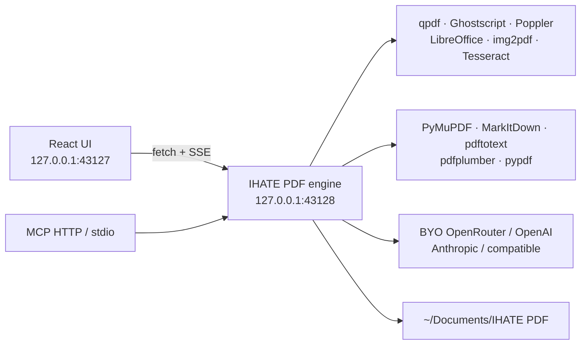

<h1 align="center">
  <picture>
    <source media="(prefers-color-scheme: dark)" srcset="docs/brand/wordmark-dark.svg" />
    
  </picture>
</h1>

<p align="center">
  <strong>A local-first desktop PDF studio.</strong><br />
  Merge, split, extract, and analyze on this computer.<br />
  No iLovePDF caps. No accounts. No upload.
</p>

<p align="center">
  
  
  
</p>

<p align="center">
  
</p>

**IHATE PDF** is an independent Electron app. Files never leave the machine unless you tick **Use cloud LLM** on an extract, summarize, ask, or translate job. A 1&nbsp;TB PDF is limited by **free disk and time**, not by a browser heap.

It is **not affiliated with iLovePDF**.

---

## Why desktop

Browser PDF sites hit three walls: upload limits, storage quotas, and RAM. IHATE PDF keeps every file on disk and shells out to streaming CLI tools. The renderer sends **paths**, not bytes.

| You get | How |
| --- | --- |
| Merge / split / organize / rotate | `qpdf` page tree — the document is not loaded into Node |
| Compress / PDF/A / repair | `qpdf` streams; Ghostscript only when you ask for a rewrite |
| Office ↔ PDF | Local LibreOffice |
| JPG / scans → PDF | `img2pdf` without decoding a giant bitmap |
| Analyze in well under 2 s | [PyMuPDF](https://github.com/pymupdf/PyMuPDF) by default (often tens of milliseconds); [MarkItDown](https://github.com/microsoft/markitdown) for markdown; Poppler for huge files |
| Bank, M-PESA, invoice extract | Line-by-line tables + regex; M-PESA auto-detect; optional LLM refine of **extracted text only** |
| Extract anything | Local entities + your JSON schema or a plain-English request, on disk |
| Ask / summarize / translate | On-disk chunks + your key — never the PDF bytes |
| Huge batches | A job queue with bounded concurrency |

---

## Screenshots

| Home | Settings · BYO keys |
| --- | --- |
|  |  |

| Merge | Analyze PDF |
| --- | --- |
|  |  |

<p align="center">
  
  <br /><em>Same chrome, tighter window.</em>
</p>

---

## Tools

**Organize** — Merge, Split, Extract pages, Delete pages, Organize / reorder, Rotate  
**Optimize** — Compress, Repair, PDF/A  
**Convert to PDF** — JPG / scan, Word, Excel, PowerPoint, HTML  
**Convert from PDF** — JPG, Word, Excel, PowerPoint, Markdown, embedded images  
**Edit** — Watermark, page numbers, crop / margins, add text, OCR, PDF Forms  
**Security** — Protect, Unlock, Sign (image stamp), Redact, Compare  
**Analyze & AI** — Analyze PDF, Bank extract, M-PESA extract, Invoice extract, Extract anything, Ask PDF, Summarize, Translate

Missing binaries fail with an install hint instead of a silent stub.

---

## Bring your own keys

Open **Settings → API keys** and connect any of:

- **OpenRouter** — one key for GPT, Claude, Gemini, Llama, …
- **OpenAI**
- **Anthropic**
- **OpenAI-compatible** — Ollama, vLLM, LM Studio, Together, Groq, Azure, or anything that speaks `/v1/chat/completions`

Keys are encrypted with Electron `safeStorage` (OS keychain) when available, otherwise AES-256-GCM in a `0600` sidecar under the app user-data folder. After save, the UI shows `••••last4`. **Test connection** sends `ping` / `pong` — no PDF.

Optional env fallbacks: `OPENROUTER_API_KEY`, `OPENAI_API_KEY`, `ANTHROPIC_API_KEY`, `OPENAI_COMPATIBLE_API_KEY`, `OPENAI_COMPATIBLE_BASE_URL`.

---

## Run it

System tools (once):

```bash
# Debian / Ubuntu
sudo apt install qpdf poppler-utils ghostscript python3-img2pdf imagemagick \
  libreoffice-nogui python3-reportlab python3-pikepdf zip tesseract-ocr

# Fast local parse + extract (PyMuPDF is the sub-2s engine)
pip install --user -r resources/requirements-extract.txt

# macOS
brew install qpdf poppler ghostscript img2pdf imagemagick
# LibreOffice: https://www.libreoffice.org/
```

Then:

```bash
npm install
npm run dev
```

That starts:

- Vite renderer at **http://127.0.0.1:43127**
- Engine API at **http://127.0.0.1:43128**
- an Electron window (`--no-sandbox` is already in the npm script)

```bash
npm run smoke          # qpdf merge/split path
npm run test:extract   # PyMuPDF speed + bank / M-PESA / invoice / extract-anything
npm run mcp            # stdio MCP bridge (engine must be running)
```

Renderer-only: `npm run dev:web` — the engine still has to be up for picking files and jobs.

---

## Parsers

Open **Settings → Parsers** for live install status. Default path is **PyMuPDF**. Bank / M-PESA extract reads **every ledger line** (receipt, completion time, details, status, Paid In, Withdrawn, Balance). Extract anything accepts a JSON schema or a sentence like “all till numbers and the closing balance”.

| Library | Role | Speed |
| --- | --- | --- |
| **[PyMuPDF](https://github.com/pymupdf/PyMuPDF)** | Default Analyze engine | Sub-2 s (often 5–200 ms) |
| **[Microsoft MarkItDown](https://github.com/microsoft/markitdown)** | Optional markdown path | ~1–3 s |
| **[Poppler pdftotext](https://poppler.freedesktop.org/)** | Huge-file streaming fallback | Windowed, disk-safe |
| **[pdfplumber](https://github.com/jsvine/pdfplumber)** | Bank / M-PESA tables | Fast on digital ledgers |
| **[pypdf](https://github.com/py-pdf/pypdf)** | PDF Forms | Form fields only |
| **[Tesseract](https://github.com/tesseract-ocr/tesseract)** | OCR PDF | Seconds/page |

Settings also catalogs Extractous, Reducto Parse + Extract, Docling, Marker, MinerU, LlamaParse, and others — optional or cloud, never required. IHATE PDF implements the local split: **Parse** (Analyze PDF) and **Extract** (Bank / M-PESA / Invoice / Extract anything).

---

## MCP

The same engine is available to Cursor, Claude Desktop, and other MCP clients.

| Transport | How |
| --- | --- |
| HTTP JSON-RPC | Enable **Settings → MCP**, then `http://127.0.0.1:43128/mcp` |
| stdio | `node mcp/ihate-pdf-mcp.mjs` (example: [`mcp/cursor-mcp.example.json`](mcp/cursor-mcp.example.json)) |

Tools: `parse_pdf`, `extract_bank`, `extract_mpesa`, `extract_invoice`, `extract_anything`, `ask_pdf`. Paths stay on this machine. The stdio bridge reads `IHATEPDF_ENGINE` (or `IHATE_PDF_ENGINE`) and optional `IHATEPDF_MCP_URL`.

---

## Architecture



Jobs are queued so a folder of hundreds of PDFs does not fork hundreds of processes.

Outputs land in `~/Documents/IHATE PDF` (changeable in Settings). Intermediate work lives in the OS temp directory and is deleted when the job finishes. Ghostscript (lossy compress, PDF/A) can use more RAM; files over ~2&nbsp;GB stay on the `qpdf` path when that is safer.

---

## License

[MIT](LICENSE) © James Epale

Independent open-source software. Not affiliated with, endorsed by, or a substitute name for iLovePDF.
